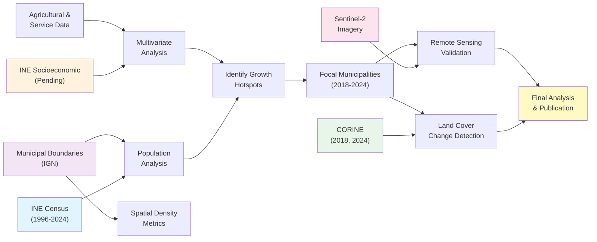

# RurIm Escape
**Geospatial Analysis of Neo-Rural Migration and Land Use Change in Spain (1996–2024)**

   

---

## 📋 Project Overview

**RurIm Escape** investigates demographic shifts in Spanish rural municipalities and their potential relationship with land use changes. This research examines neo-rural migration patterns accelerated by remote work adoption post-COVID-19, using a multi-scale temporal and multivariate approach.

### Research Design: Two-Scale Temporal Analysis

**Phase 1 – Macro-temporal Context (1996–2024):**  
Establish baseline demographic trends over 28 years to identify long-term patterns of rural depopulation and repopulation.

**Phase 2 – Focal Period Analysis (2018–2024):**  
Zoom into recent years to detect neo-rural migration signals, focusing on municipalities with accelerated growth during the pandemic period.

### Current Research Questions

- Which Spanish municipalities experienced significant population growth across the full 28-year period (1996–2024)?
- Do high-growth municipalities show accelerated growth in 2018–2024 compared to historical trends?
- What demographic characteristics (sex ratio, population density, age structure) define repopulation hotspots?
- **[In Progress]** How do demographic shifts correlate with service accessibility, economic conditions, and agricultural structure?
- **[Planned]** Can land use changes (2018–2024) be detected and linked to multivariate socioeconomic patterns?

---

## 🛠️ Technical Stack

| Category | Tools & Libraries |
|----------|------------------|
| **Data Processing** | Pandas, NumPy, DuckDB |
| **Geospatial Analysis** | GeoPandas, Shapely, QGIS (PyQGIS) |
| **Visualization** | Matplotlib, Seaborn, Folium, Plotly |
| **Workflow** | Jupyter Lab, Conda, Git/GitHub |
| **Development** | Python 3.11+, Codespaces |

**Note:** DuckDB is the primary database tool for analysis and queries. PostgreSQL/PostGIS integration is planned for future scalability.

---

## 📊 Data Integration Workflow



---

## 📁 Repository Structure

```
rural-migration-land-use-spain/
│
├── data/
│   ├── agriculture_livestock/
│   │   ├── derived/
│   │   ├── processed/
│   │   └── raw/
│   │
│   ├── demography/
│   │   ├── derived/
│   │   │   ├── nan/                          # NaN analysis outputs
│   │   │   │   ├── nan_analysis_detailed.csv
│   │   │   │   ├── nan_analysis_pivoted.csv
│   │   │   │   ├── nan_analysis_by_comarca.csv
│   │   │   │   └── nan_analysis_geo.gpkg
│   │   │   ├── padron_variations_all_k.csv
│   │   │   └── padron_variations_k_*.csv
│   │   ├── processed/
│   │   │   └── 01_padron_clean_1996_2024.csv
│   │   └── raw/
│   │       ├── 00_raw_padron_1996_2024.csv
│   │       └── diccionario2024.xlsx
│   │
│   ├── landuse/
│   │   ├── derived/
│   │   ├── processed/
│   │   └── raw/
│   │
│   ├── remote_sensing/
│   │   ├── derived/
│   │   ├── processed/
│   │   └── raw/
│   │
│   ├── services/
│   │   ├── derived/
│   │   ├── processed/
│   │   └── raw/
│   │
│   └── spatial/
│       ├── derived/
│       │   ├── mun_geographic_administrative_hierarchy.csv
│       │   ├── mun_geographic_administrative_hierarchy.gpkg
│       │   ├── territorial_anomalies.csv
│       │   └── territorial_anomalies.gpkg
│       ├── processed/
│       └── raw/
│
├── notebooks/
│   ├── inQGIS_exploratory/
│   │   └── explore_agricultural_density_2020.ipynb
│   │   └── explore_clc2018_mun_stats.ipynb
│   │
│   ├── 000_environment_check.ipynb
│   ├── 00_geographic_administrative_hierarchy.ipynb
│   ├── 01_data_cleaning_padron_historico.ipynb
│   ├── 02_demography_population_density.ipynb
│   ├── 03_demography_sex_ratio.ipynb
│   ├── 04_population_variation_analysis.ipynb
│   └── 05_nan_analysis_padron_municipal.ipynb
│
├── scripts/
│   └── compute_multi_interval_variation.py
│
├── docs/
│   ├── data_sources.md
│   ├── ine_request_doc-01_2026.md
│   └── methodology.md
│
├── .gitignore
├── LICENSE
├── README.md
└── requirements.txt
```

---

## ✅ Completed Work

### 1. **Geographic & Administrative Hierarchy** 
**Notebook:** `00_geographic_administrative_hierarchy.ipynb`

Establishes the spatial framework for all municipal-level analysis.

**Outputs:**
- `mun_geographic_administrative_hierarchy.csv` – Hierarchical codes (CCAA, Provincia, Comarca, Mun_Code)
- `mun_geographic_administrative_hierarchy.gpkg` – Boundaries + attributes (EPSG:4258)
- `territorial_anomalies.csv` / `.gpkg` – Municipalities with administrative irregularities

---

### 2. **Data Cleaning & Standardization**
**Notebook:** `01_data_cleaning_padron_historico.ipynb`

Processes raw INE census data into analysis-ready format.

**Source:** INE Padrón Municipal Histórico (1996–2024)  
**Coverage:** 8,132 municipalities × 28 years (excluding 1997)  
**Data Quality:** 99.7% completeness (1,860 missing values documented)

**Key Processing:**
- Standardization of INE CSV format (semicolon-separated, Latin-1 encoding)
- Municipality code extraction with leading zero preservation
- Removal of invalid census year (1997)
- Handling of missing values with detailed documentation

**Output:**
- `01_padron_clean_1996_2024.csv` – Clean, tidy long-format dataset (683,088 records)

---

### 3. **Demographic Indicators: Population Density**
**Notebook:** `02_demography_population_density.ipynb`

Calculates municipal population density (inhabitants/km²) for 1996–2024.

**Metrics:**
- Total population density: Pop_Total / Area
- Density by sex category: Hombres/Area, Mujeres/Area
- Temporal trends and spatial distribution

**Key Findings (2024):**
- Mean density: ~78 hab/km²
- Median density: ~25 hab/km² (highly right-skewed distribution)
- 6,000+ municipalities classified as rural (<50 hab/km²)

**Output:**
- `03_population_density_1996_2024.csv` – Density metrics across time

---

### 4. **Demographic Indicators: Sex Ratio**
**Notebook:** `03_demography_sex_ratio.ipynb`

Computes masculinity ratio (Male/Female × 100) for all municipalities and years.

**Metrics:**
- Sex ratio by municipality and year
- Temporal evolution and spatial patterns
- Identification of demographic anomalies

**Key Findings (2024):**
- National mean sex ratio: ~98.5 (slightly more women)
- Regional variation: 90–110 ratio across municipalities
- Rural areas trend toward higher female proportions (aging effect)

**Output:**
- `03_demography_sex_ratio_1996_2024.csv` – Sex ratio time series

---

### 5. **Population Variation Analysis: Multi-Interval Change**
**Notebook:** `04_population_variation_analysis.ipynb`

Analyzes population change at multiple temporal intervals (k = 1 to 28 years).

**Methodology:**

```
Variation(k, t) = ((Pop[t] - Pop[t-k]) / Pop[t-k]) × 100
```

**Outputs:**
- `padron_variations_all_k.csv` – Combined dataset (all intervals)
- `padron_variations_k_01.csv` through `k_28.csv` – Individual CSVs per interval length

**Features:**
- Robust handling of missing data and division-by-zero cases
- Vectorized operations for computational efficiency
- Enables identification of growth breakpoints and acceleration periods

**Reusable Function:**
- `compute_multi_interval_variation.py` – Portable function for custom interval analysis

---

### 6. **Data Quality Assessment: Missing Values (NaN) Analysis**
**Notebook:** `05_nan_analysis_padron_municipal.ipynb`

Comprehensive diagnostic of missing values in census data.

**Scope:**
- Identifies which municipalities have incomplete data
- Quantifies data gaps by demographic category (Hombres, Mujeres, Total)
- Maps temporal patterns of missing values
- Provides usage recommendations by analysis type

**Key Findings:**
- **38 municipalities** (0.47%) with missing data
- **8,094 municipalities** (99.53%) with complete records
- NaN concentrated in older years (1996–2005)
- **2019–2024:** Practically zero missing values

**Outputs:**
- `nan_analysis_detailed.csv` – Long format (114 records: 38 mun × 3 categories)
- `nan_analysis_pivoted.csv` – Wide format (38 municipalities, 1 row each)
- `nan_analysis_by_comarca.csv` – County-level summary (33 affected counties)
- `nan_analysis_geo.gpkg` – Geospatial version with 3 layers (detailed, pivoted, comarca)

**Usage Recommendations:**
- ✅ **2019–2024 analysis:** Use without restrictions
- ✅ **2010–2024 analysis:** Very reliable (max 20 mun with gaps in 2010)
- ⚠️ **1996–2024 analysis:** Document affected municipalities
- ✅ **Regional analysis:** Safe (NaN not geographically clustered)

---

### 7. **Agricultural & Livestock Farm Density (2020)**
**Notebook:** `explore_agricultural_density_2020.ipynb` (QGIS/PyQGIS)

Calculates municipal-level farm density metrics from INE Censo Agrario 2020.

**Processing:**
- Layer reprojection to ETRS89/UTM 30N (EPSG:25830) for accurate area calculation
- Municipal area computation in hectares
- Density calculation with null value handling

**Output Fields:**
- `ha` – Municipal area (hectares)
- `dens_agr` – Agricultural farm density (farms/ha)
- `dens_gan` – Livestock operation density (operations/ha)

**Integration:** Results merged back to original geodatabase layer (EPSG:4258)

---

### 8. **Exploratory Analysis: CORINE Land Cover 2018**
**Notebook:** `explore_clc2018_mun_stats.ipynb`

Aggregates CORINE Land Cover 2018 (100m resolution) to municipal level.

**Purpose:** Establishes baseline for future 2018–2024 land cover change detection

---

## 🔧 Analysis Pipeline

### Data Flow

```
Raw INE Census Data
        ↓
[01] Data Cleaning & Standardization
        ↓
Clean Census Dataset (01_padron_clean_1996_2024.csv)
        ├─→ [02] Population Density Calculation
        ├─→ [03] Sex Ratio Calculation
        ├─→ [04] Multi-Interval Variation Analysis
        ├─→ [05] NaN Diagnostic & Data Quality Assessment
        └─→ [Geographic Integration]
                ↓
        + Administrative Hierarchy (00)
        + Farm Density (07)
        ├─→ Identify Growth Hotspots
        ├─→ Filter Focal Municipalities (2018–2024 accelers.)
        └─→ Multivariate Analysis (pending socioeconomic data)
```

---

## 🚧 In Progress

### **INE Socioeconomic Data Integration** (Data Request: Jan 2026)
**Status:** Awaiting INE response

**Expected Variables (40+):**
- **Demographic:** Age distribution, foreign vs. autochthonous population
- **Economic:** Household income evolution, employment, unemployment, retirement rates
- **Services:** Hospital/highway access times, pharmacy counts, internet coverage (≥30 Mbps, ≥100 Mbps)
- **Agricultural:** Farm counts, Land use (UAA/SAU), livestock numbers, CAP subsidies, organic farming

**Integration Plan:**
1. Clean and standardize upon delivery
2. Join with census data via `Mun_Code`
3. Exploratory correlation analysis
4. Feature selection for multivariate models

---

### **DuckDB Database & Analysis** (Q2 2026)
**Purpose:** Efficient querying and hypothesis testing across multiple data layers

**Planned Workflows:**
- Aggregate municipal characteristics at comarca/provincia levels
- Calculate composite indices (e.g., "demographic vitality score")
- Filter and stratify municipalities for focal analysis
- Time series queries (e.g., "municipalities with >10% growth 2018–2024")

**Example Query (pseudocode):**
```sql
SELECT mun_code, mun_name, comarca, 
       pop_2024, pop_2018, growth_pct,
       sex_ratio_2024, density_2024, dens_agr_2020
FROM padron_analysis
WHERE growth_pct > 10 AND pop_2024 > 5000
ORDER BY growth_pct DESC
```

---

### **Land Cover Change Detection (Q2 2026)**
**Status:** Awaiting CORINE 2024 release (expected Q2 2026)

**Approach – Focused on 2018–2024:**
1. **Baseline:** CORINE 2018 (44 land use classes, 100m resolution)
2. **Target:** CORINE 2024 (upon release)
3. **Spatial Filter:** Municipalities with >15% population growth (2018–2024)
4. **Change Categories:**
   - Agricultural expansion/abandonment (class transitions 211↔231)
   - Urbanization (artificial surfaces 111–112)
   - Pasture/grassland changes (231, 321)

**Validation:** Cross-reference with INE agricultural census (2020)

---

### **Remote Sensing Validation (Q3 2026)**
**Objective:** Validate land cover changes with multispectral vegetation indices (2018–2024)

**Workflow:**
1. Median compositing per growing season (April–September) for 2018 and 2024
2. Index calculation:
   - **NDVI** – Agricultural activity, vegetation health
   - **NDWI** – Irrigation expansion
   - **NDBI** – Urban sprawl detection
3. Change detection: NDVI₂₀₂₄ - NDVI₂₀₁₈
4. Statistical correlation with population growth and agricultural variables

**Data Source:** Google Earth Engine (Sentinel-2 L2A, 10m resolution)

---

## 📊 Project Status & Completeness

| Component | Status | Completeness |
|-----------|--------|--------------|
| Census Data Cleaning | ✅ Complete | 100% |
| Demographic Indicators | ✅ Complete | 100% |
| Population Variation Analysis | ✅ Complete | 100% |
| Data Quality Assessment (NaN) | ✅ Complete | 100% |
| Geographic Framework | ✅ Complete | 100% |
| Farm Density Metrics | ✅ Complete | 100% |
| **Socioeconomic Integration** | 🚧 In Progress | ~5% |
| **DuckDB Database Setup** | 🚧 In Progress | ~5% |
| **Land Cover Change Analysis** | ⏳ Pending Data | ~0% |
| **Remote Sensing Validation** | ⏳ Planned | ~0% |
| **Final Analysis & Publication** | ⏳ Planned | ~0% |

**Overall Project Completeness:** ~**10%**

---

## 🚀 Reproducibility

### Environment Setup

```bash
git clone https://github.com/juanzotes/rural-migration-land-use-spain.git
cd rural-migration-land-use-spain
conda create -n rurim_escape python=3.11
conda activate rurim_escape
pip install -r requirements.txt
jupyter lab
```

### Data Access

⚠️ **Important:** Data files are NOT included in this repository.

**Required datasets:**
- **Census data (Padrón Municipal Histórico):** [INE Download](https://www.ine.es/dyngs/INEbase/es/operacion.htm?c=Estadistica_C&cid=1254736177012&menu=resultados&idp=1254734710990)
- **Agricultural census (Censo Agrario 2020):** [INE Download](https://www.ine.es/dyngs/INEbase/es/operacion.htm?c=Estadistica_C&cid=1254736176851&menu=resultados&idp=1254735727106)
- **Municipal boundaries:** [IGN Centro de Descargas](https://centrodedescargas.cnig.es/)

See `docs/data_sources.md` for detailed instructions and expected folder structure.

---

## 📈 Key Preliminary Insights

### Macro-temporal Trends (1996–2024)

- **Sample Size:** 8,220 municipalities, 28-year time series
- **Data Completeness:** 99.7% (robust baseline for analysis)
- **Observation:** Certain peri-urban and coastal municipalities exhibit sustained growth (>20% cumulative), with potential acceleration in 2018–2024

### Focal Period (2018–2024)

- **Working Hypothesis:** Municipalities with anomalous growth in 2018–2024 (relative to 1996–2018 trend) may represent neo-rural migration hotspots driven by pandemic-era remote work adoption
- **Next Step:** Prioritize these municipalities for land cover change detection and socioeconomic correlation analysis

---

## 🎯 Next Steps (Priority Order)

- [x] Complete demographic indicators (density, sex ratio)
- [x] Calculate agricultural farm densities (2020)
- [x] Comprehensive NaN diagnosis and data quality documentation
- [ ] 🚧 Integrate INE socioeconomic variables (upon delivery)
- [ ] 🚧 Set up DuckDB for efficient multivariate queries
- [ ] 🗺️ Land cover change analysis (upon CORINE 2024 release)
- [ ] 🛰️ Remote sensing validation (Sentinel-2 NDVI/NDWI/NDBI)
- [ ] 📊 Interactive visualization dashboards (optimized for GitHub)
- [ ] 📄 Research publication & findings dissemination

---

## 📜 License

MIT License – see LICENSE file for details.

---

## 🙏 Acknowledgments

- **Cristina Herrero Jáuregui** – ADAPTA Research Group (Socio-Ecological Systems, Landscape & Rural Development)
- **Universidad Complutense de Madrid** – Research support
- **Instituto Nacional de Estadística (INE)** – Historical census and agricultural census data
- **Instituto Geográfico Nacional (IGN)** – Municipal boundaries and geographic data

---

## 👨‍🔬 Author

**Juan Zotes**  
GIS Research Analyst | Geographer & Environmental Scientist

Complutense University of Madrid

[](https://www.linkedin.com/in/juan-zotes-orcajo-88a0a51aa/)
[](mailto:jzotes01@ucm.es)

📧 **Contact:** [jzotes01@ucm.es](mailto:jzotes01@ucm.es) | [juanzotes@gmail.com](mailto:juanzotes@gmail.com)

*Environmental scientist exploring rural systems, geospatial methods, and landscape dynamics. 
Committed to open-source research and interdisciplinary collaboration.*

📍 Madrid, Spain | 🔬 Geospatial Scientist  
🛠️ Python | QGIS | GeoPandas | DuckDB | Remote Sensing 

---

**Last updated:** February 2026 | **Project initiated:** December 2025

*This project represents rigorous scientific methodology applied to policy-relevant research questions in rural development and neo-rural migration.*
