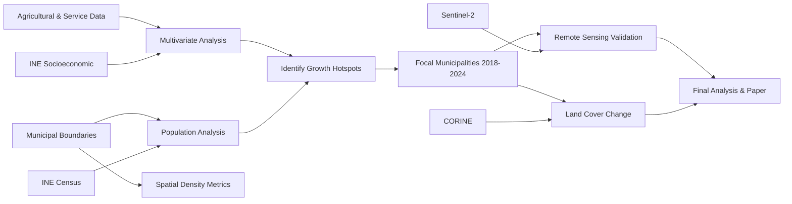

# Data Sources

Comprehensive listing of all datasets used or planned for the RurIm Escape project.

---

## ✅ Currently Integrated

### 1. INE Padrón Municipal (Historical Census)
**Status:** ✅ Integrated  
**Source:** Instituto Nacional de Estadística (INE)  
**URL:** https://www.ine.es/dynt3/inebase/es/index.htm?padre=517  
**Coverage:** 1996–2024 (excluding 1997)  
**Variables:**
- Total population
- Population by sex (Male/Female)

**Spatial Resolution:** Municipal (8,131 municipalities)  
**Format:** CSV (semicolon-separated, Latin-1 encoding)  
**Processing:** See [`01_data_cleaning_padron_historico.ipynb`](../notebooks/01_data_cleaning/)

**Download Instructions:**
1. Visit INE website
2. Navigate to: Demografía y población → Cifras de población → Padrón municipal
3. Select: Serie histórica 1996-2024
4. Download as CSV with all municipalities

---

### 2. Spanish Municipal Boundaries
**Status:** ✅ Integrated  
**Source:** Instituto Geográfico Nacional (IGN)  
**URL:** https://centrodedescargas.cnig.es/CentroDescargas/index.jsp  
**Coverage:** 2024 (administrative boundaries)  
**CRS:** EPSG:4258 (ETRS89 geographic)  
**Format:** Shapefile (.shp)

**Download Instructions:**
1. IGN Centro de Descargas
2. Section: Información Geográfica de Referencia → Líneas Límite
3. Download: "Límites municipales (INSPIRE)"

**Usage:** Area calculations (reprojected to EPSG:25830 for metric units)

---

## ⏳ Pending Integration

### 3. INE Socioeconomic & Agricultural Variables
**Status:** ⏳ Data request submitted January 2025  
**Expected Delivery:** February 2025  
**Variables:** See [`data_request_ine.md`](data_request_ine.md) for full list

**Categories:**
- Demographic (age structure, foreign population)
- Economic (income, employment, unemployment)
- Service accessibility (hospitals, schools, internet) --> Other sources: see [`data_request_ine.md`](data_request_ine.md)
- Agricultural (farm counts, SAU, livestock, tenure)

**Planned Integration:** March 2025 (see notebook `04_ine_data_integration.ipynb` - WIP)

---

### 4. Corine Land Cover (CLC)
**Status:** ⏳ CLC 2024 not yet released  
**Source:** Copernicus Land Monitoring Service  
**URL:** https://land.copernicus.eu/pan-european/corine-land-cover  

**Datasets:**
- **CLC 2018** (available) - Baseline
- **CLC 2024** (expected Q2 2025) - For change detection

**Specifications:**
- **Resolution:** 100m × 100m
- **Classes:** 44 land cover types
- **CRS:** EPSG:3035 (ETRS89-LAEA Europe)
- **Format:** GeoTIFF (raster) + GeoPackage (vector)

**Relevant Classes:**
- 111-112: Urban fabric
- 211: Non-irrigated arable land
- 212: Permanently irrigated land
- 231: Pastures
- 321: Natural grasslands

**Download Instructions:**
1. Visit Copernicus Land portal
2. Select: Pan-European → High Resolution Layers → Corine Land Cover
3. Choose year and region (Spain)
4. Format: GeoTIFF for raster analysis, GeoPackage for vector

---

### 5. Sentinel-2 Satellite Imagery
**Status:** 📅 Planned Q2 2025  
**Source:** Google Earth Engine / Copernicus Open Access Hub  
**URL:** https://earthengine.google.com/  

**Specifications:**
- **Sensor:** Sentinel-2 MSI (MultiSpectral Instrument)
- **Processing Level:** L2A (Surface Reflectance)
- **Resolution:** 10m (B2, B3, B4, B8), 20m (B5, B6, B7, B8A)
- **Temporal Coverage:** 2018, 2024
- **Temporal Compositing:** Median reducer per growing season (April–September)

**Planned Indices:**
- **NDVI:** `(B8 - B4) / (B8 + B4)` - Vegetation health
- **NDWI:** `(B3 - B8) / (B3 + B8)` - Water/irrigation
- **NDBI:** `(B11 - B8) / (B11 + B8)` - Built-up areas

**Access Method:** Google Earth Engine Python API (requires authentication)

---

## 🔍 Potential Additional Sources (Under Consideration)

### 6. Service Accessibility Data
**Status:** 🔎 Investigating alternative sources (INE referred to MITERD, but incorrect)

**Hospitals:**
- Ministry of Health: https://www.sanidad.gob.es/
- Dataset: National Hospital Catalog

**Pharmacies:**
- General Council of Pharmaceutical Colleges: https://www.portalfarma.com/

**Schools:**
- Ministry of Education: https://www.educacion.gob.es/
- Dataset: Non-university education centers

**Internet Coverage:**
- Ministry of Digital Transformation: https://avancedigital.mineco.gob.es/
- Dataset: Broadband coverage reports (% households ≥30 Mbps, ≥100 Mbps)

**Road Network:**
- MITMA (Ministry of Transport): https://www.mitma.gob.es/
- Dataset: State road network (for isochrone analysis)

**Alternative:** OpenStreetMap (OSM) for all service locations
- Pros: Free, comprehensive, up-to-date
- Cons: Variable quality, requires validation

---

## 📊 Data Integration Workflow



---

## 🔐 Data Access & Licensing

| Dataset | License | Attribution Required |
|---------|---------|---------------------|
| INE Census | Open Data (CC BY 4.0) | Yes - "Source: INE" |
| IGN Boundaries | CC BY 4.0 | Yes - "Source: IGN" |
| Corine Land Cover | Free for all uses | Yes - "Source: Copernicus" |
| Sentinel-2 | Free and Open (ESA) | Yes - "Contains modified Copernicus Sentinel data" |

**Project License:** MIT (code) + CC BY 4.0 (data derivatives)

---

## 📝 Data Citation Format

When publishing results:

```bibtex
@misc{ine_padron_2024,
  author = {{Instituto Nacional de Estadística}},
  title = {Padrón Municipal de Habitantes (1996-2024)},
  year = {2024},
  url = {https://www.ine.es},
  note = {Accessed: 2025-01-19}
}

@dataset{corine_2018,
  author = {{European Environment Agency}},
  title = {Corine Land Cover 2018},
  year = {2019},
  publisher = {Copernicus Land Monitoring Service},
  url = {https://land.copernicus.eu/pan-european/corine-land-cover/clc2018}
}
```

---

*Last updated: January 2025*
